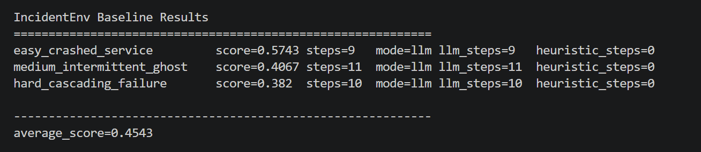

# IncidentEnv: On-Call Incident Response Triage

IncidentEnv is a real-world OpenEnv task where an agent plays on-call SRE: investigate alerts, identify root cause, apply a fix, and submit diagnosis.

Built for the Meta x Hugging Face OpenEnv Hackathon.

## Hackathon Requirement Coverage

- Real-world utility: production incident triage (not a toy domain).
- OpenEnv spec: typed action/observation/reward models, reset/step/state loop, `openenv.yaml`.
- 3 graded tasks: easy/medium/hard with deterministic scoring in (0.0, 1.0).
- Reward shaping: dense partial-progress signals + penalties.
- Baseline script: root `inference.py` with reproducible task scores.
- Deployment: Hugging Face Space-ready + working `Dockerfile`.

## Action Space

| Command | Purpose |
|---|---|
| query_logs | Inspect recent service logs |
| check_metrics | Inspect latency/error/cpu/memory metrics |
| check_service_status | Inspect health/readiness |
| trace_dependency | Inspect service dependency graph |
| check_recent_deploys | Inspect deployment history |
| restart_service | Restart workloads |
| rollback_deploy | Roll back to prior deploy |
| scale_service | Increase capacity/replicas |
| escalate | Escalate to on-call alias |
| submit_diagnosis | Submit root cause and finish episode |

## Observation Space

Returned state includes:
- `done`, `reward`, `step_number`, `max_steps`
- `alert_message`, `action_result`
- `services_status`, `available_services`
- `clues_found`, `actions_taken`
- `metadata`

## Tasks

1. `easy_crashed_service`: bad deploy on payment-service, correct fix is rollback.
2. `medium_intermittent_ghost`: one leaking replica after deploy, correct fix is rollback api-gateway.
3. `hard_cascading_failure`: cache exhaustion causes latency cascade, correct fix is scale cache.

## Reward + Grader

- Step reward: clue discovery, relevance, corrective action quality, diagnosis quality, time penalty, escalation shaping.
- Final grader weights:
    - diagnosis accuracy: 40%
    - correct fix: 30%
    - efficiency: 15%
    - no collateral damage: 15%

## Setup

```bash
python -m venv .venv
source .venv/bin/activate
pip install -r server/requirements.txt
```

Run server:

```bash
uvicorn server.app:app --host 0.0.0.0 --port 7860
```

Run tests:

```bash
python -m pytest
```

## Baseline Inference

Required env vars:
- `API_BASE_URL`
- `MODEL_NAME`
- `HF_TOKEN`

Run:

```bash
cp .env.example .env
# edit .env with your values
set -a
source .env
set +a
python inference.py
```

Latest baseline run:

| Task | Score | Steps |
|---|---:|---:|
| easy_crashed_service | 0.5743 | 9 |
| medium_intermittent_ghost | 0.4067 | 11 |
| hard_cascading_failure | 0.382 | 11 |
| average | 0.4543 | - |



## API Endpoints

- `POST /reset`
- `POST /step`
- `GET /state`
- `GET /health`
- `GET /tasks`
- `GET /grader`
- `POST /baseline`